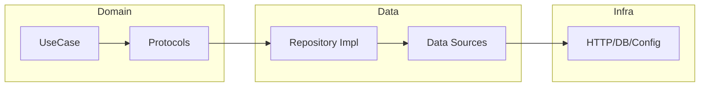
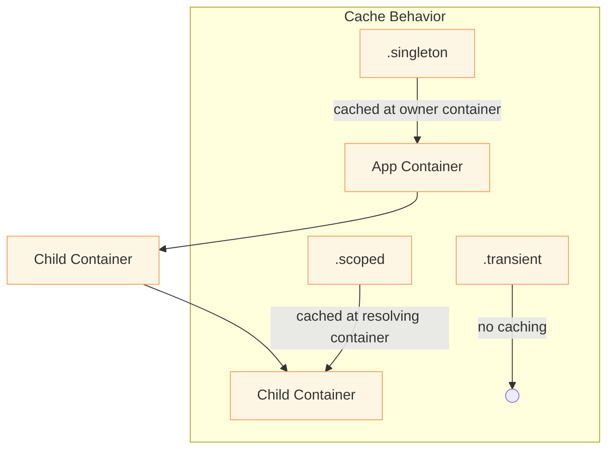
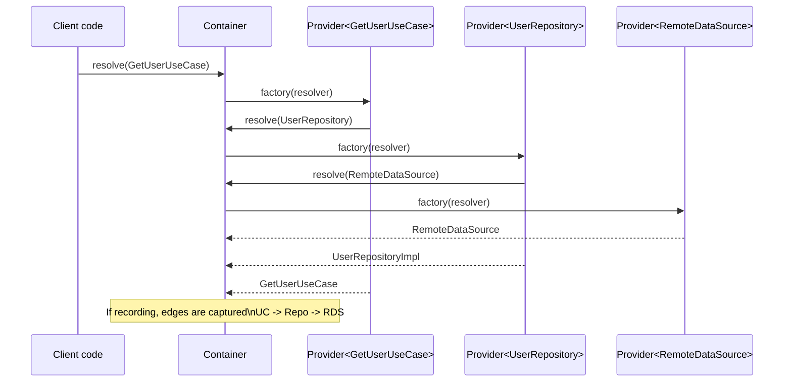

SwiftHilt — A pragmatic, DAG‑aware DI for Swift (inspired by Hilt)
=================================================================

SwiftHilt is a lightweight, type‑safe dependency injection toolkit for Swift. It focuses on pure Swift constructor injection (Clean Architecture), offers scopes and qualifiers, supports multibindings, and includes a DAG recorder so you can visualize dependency graphs. SwiftUI/UIKit integrations are optional and kept separate from core DI.

Table of Contents
- What You Get
- Global Quick Start
- Installation
- Quick Start (Pure Swift)
- Step‑by‑Step Guide
- MVVM + Clean Architecture (iOS)
- Core Concepts
- API Reference
- Clean Architecture Example
- DAG Recording and Visualization
- Scopes and Lifetimes
- Qualifiers
- Multibindings (Set/Map)
- Threading and Safety
- Testing Guidance
- SwiftUI and UIKit (Optional)
- Roadmap (Macros and More)
 - Visual Overview
 - Example: iOS Task Manager

What You Get
- Type‑safe resolution using concrete types and optional qualifiers.
- Scopes: `singleton`, `scoped` (per container), `transient`.
- Hierarchical containers for lifecycle scoping (parent → child).
- Simple DSL to register providers and multibindings.
- Property wrappers for convenience where appropriate (`@Injected`, SwiftUI `@EnvironmentInjected`).
- DAG recorder: observe actual runtime edges, compute a topological order, and export to Graphviz DOT.

Global Quick Start
```swift
import SwiftHilt
install { provide(Api.self) { _ in RealApi() } }
register(Repo.self) { r in Repo(api: r.resolve()) }
let api: Api = resolve()
let repo: Repo = resolve()
```

Installation
- Swift Package Manager: open the folder with `Package.swift` in Xcode or add the repo URL as a dependency in your project.
- Minimum platforms: iOS 13, macOS 11, tvOS 13, watchOS 6.
- Minimum Swift: 5.7 for the core library. Swift 5.9 will be required once macros are added (see Roadmap).

Quick Start (Pure Swift)
1) Define and register services (global convenience or explicit container)
```swift
protocol Api {}
final class RealApi: Api {}

// Option A: global facade
install { provide(Api.self, lifetime: .singleton) { _ in RealApi() } }
let api: Api = resolve()

// Option B: explicit container (recommended for larger apps)
let container = Container()
container.install { provide(Api.self, lifetime: .singleton) { _ in RealApi() } }
let api2: Api = container.resolve()
```

2) Resolve where needed
```swift
let api = resolve(Api.self)
// optionally optional or many
let maybe = optional(Api.self)
```

3) Constructor injection (Clean Architecture)
```swift
final class Repository {
  let api: Api
  init(api: Api) { self.api = api }
}

register(Repository.self, lifetime: .scoped) { r in
  Repository(api: r.resolve(Api.self))
}

let repo: Repository = resolve()
```

Core Concepts
- Container: The DI registry and resolver. Supports parent/child hierarchies.
- Resolver: Minimal protocol used by providers to resolve dependencies.
- Lifetime: Caching strategy per binding: `.singleton`, `.scoped`, `.transient`.
- Qualifier: Disambiguates multiple bindings for the same type (e.g., `Named("prod")`).
- Multibindings: Register multiple providers under the same type, resolved as `[T]`.
- Modules DSL: `install { provide(...) { ... }; contribute(...) { ... } }`.
- ResolverContext: Thread‑local resolver for `@Injected` in non‑SwiftUI code.
- DAG Recorder: Captures observed edges during resolution to visualize and validate.

API Reference
- Container
  - `init(parent: Container? = nil)`
  - `func child() -> Container` — creates a child scope (inherits parent bindings, separate scoped cache).
  - `func clearCache()` — clears this container’s local caches (scoped and resident singletons owned by it).
  - `@discardableResult func register<T>(_ type: T.Type = T.self, qualifier: Qualifier? = nil, lifetime: Lifetime = .singleton, factory: @escaping (Resolver) -> T) -> Self`
  - `@discardableResult func registerMany<T>(_ type: T.Type = T.self, qualifier: Qualifier? = nil, _ factory: @escaping (Resolver) -> T) -> Self`
  - `func resolve<T>(_ type: T.Type = T.self, qualifier: Qualifier? = nil) -> T`
  - `func optional<T>(_ type: T.Type = T.self, qualifier: Qualifier? = nil) -> T?`
  - `func resolveMany<T>(_ type: T.Type = T.self, qualifier: Qualifier? = nil) -> [T]`
  - DAG utilities:
    - `func startRecording()` — observe provider→dependency edges during resolution.
    - `func exportDOT() -> String?` — Graphviz DOT for the observed graph.
    - `func prewarmSingletons()` — eagerly instantiate singletons to validate wiring and warm caches.

- Global API (convenience)
  - Resolution (uses `Injection.current` if set, else default container):
    - `resolve<T>(_ type: T.Type = T.self, qualifier: Qualifier? = nil) -> T`
    - `optional<T>(_ type: T.Type = T.self, qualifier: Qualifier? = nil) -> T?`
    - `resolveMany<T>(_ type: T.Type = T.self, qualifier: Qualifier? = nil) -> [T]`
  - Registration (operates on default container):
    - `install(@ModuleBuilder _ builder: () -> [Registration])`
    - `register<T>(_ type: T.Type = T.self, qualifier: Qualifier? = nil, lifetime: Lifetime = .singleton, _ factory: @escaping (Resolver) -> T)`
    - `registerMany<T>(_ type: T.Type = T.self, qualifier: Qualifier? = nil, _ factory: @escaping (Resolver) -> T)`
  - Default container control/utilities:
    - `useContainer(_ container: Container)` — replace the default container.
    - `prewarmSingletons()` — eager validate singletons on default container.
    - `startRecording()` / `exportDOT()` — DAG helpers on default container.

- Lifetime
  - `.singleton` — one instance per container that owns registration; visible to children.
  - `.scoped` — one instance per resolving container; distinct in each scope.
  - `.transient` — a new instance every resolve.

- Qualifiers
  - `protocol Qualifier: Hashable`
  - `struct Named: Qualifier, ExpressibleByStringLiteral` — `Named("prod")`, `"prod"`
  - Custom qualifiers can be simple structs conforming to `Qualifier`.

- Modules DSL
  - `func install(@ModuleBuilder _ builder: () -> [Registration])`
  - `func provide<T>(_ type: T.Type = T.self, qualifier: Qualifier? = nil, lifetime: Lifetime = .singleton, _ factory: @escaping (Resolver) -> T) -> Registration`
  - `func contribute<T>(_ type: T.Type = T.self, qualifier: Qualifier? = nil, _ factory: @escaping (Resolver) -> T) -> Registration` (multibindings)

- ResolverContext (pure Swift convenience)
  - `ResolverContext.with(_ resolver: Resolver, _ body: () throws -> T) rethrows -> T`
  - `ResolverContext.current` (thread‑local)
  - Works with `@Injected` to resolve without plumbing the container through every function signature.

- Property Wrappers
  - `@Injected var dep: T` — resolves from `ResolverContext.current`.
  - `@EnvironmentInjected var dep: T` — SwiftUI only, resolves from environment (optional; see later).
  - `@Inject var dep: T` — resolves from environment (Task/Thread/Global) or an enclosing `HasResolver`.

Clean Architecture Example
```swift
// Domain
protocol UserRepository { func get(id: String) -> User }
struct GetUserUseCase {
  let repo: UserRepository
  init(repo: UserRepository) { self.repo = repo }
  func callAsFunction(_ id: String) -> User { repo.get(id: id) }
}

// Data
final class HttpClient { /* ... */ }
final class RemoteDataSource { init(client: HttpClient, baseURL: URL) { /* ... */ } /* ... */ }
final class CacheDataSource { /* ... */ }
final class UserRepositoryImpl: UserRepository { init(remote: RemoteDataSource, cache: CacheDataSource) { /* ... */ } /* ... */ }

// Composition (global)
install {
  provide(URL.self, qualifier: Named("prodBase"), lifetime: .singleton) { _ in URL(string: "https://api.example.com/user/")! }
  provide(HttpClient.self, lifetime: .singleton) { _ in HttpClient() }
}
register(RemoteDataSource.self) { r in RemoteDataSource(client: r.resolve(HttpClient.self), baseURL: r.resolve(URL.self, qualifier: Named("prodBase"))) }
register(CacheDataSource.self, lifetime: .singleton) { _ in CacheDataSource() }
register(UserRepository.self) { r in UserRepositoryImpl(remote: r.resolve(RemoteDataSource.self), cache: r.resolve(CacheDataSource.self)) }
register(GetUserUseCase.self, lifetime: .transient) { r in GetUserUseCase(repo: r.resolve(UserRepository.self)) }

// Use
let getUser: GetUserUseCase = resolve()
let user = getUser("123")
```


DAG Recording and Visualization
- Why: See the graph you actually use at runtime; catch cycles; explain wiring to teammates.
- How:
  ```swift
  c.startRecording()
  _ = c.resolve(GetUserUseCase.self)
  if let dot = c.exportDOT() { print(dot) }
  ```
- DOT can be rendered with Graphviz (`dot -Tpng graph.dot > graph.png`) or online viewers.
- Notes:
  - Edges are recorded when providers resolve dependencies.
  - `resolveMany` creates a pseudo aggregator node `[T]` with edges `[T] -> T`.
  - For deep graphs, record a representative startup path (e.g., composition root resolves) to capture meaningful edges.

Scopes and Lifetimes
- `.singleton`
  - Cached where the provider is registered; shared with children.
  - Good for clients (HTTP, DB), configs, caches.
- `.scoped`
  - Cached in the currently resolving container (per scope).
  - Good for request/feature/session‑scoped state.
- `.transient`
  - No caching; a new instance every resolve.
  - Good for lightweight value objects or stateless helpers when lifetime control isn’t needed.

Qualifiers
- Use `Named("prod")`, `Named("mock")` or define custom qualifier types for stronger typing.
- Registration and resolution must specify the same qualifier to match.
  ```swift
  c.register(URL.self, qualifier: Named("prod")) { _ in URL(string: "...")! }
  let url = c.resolve(URL.self, qualifier: Named("prod"))
  ```

Multibindings (Set/Array)
- Register multiple providers for the same type and resolve as `[T]`.
  ```swift
  protocol Middleware {}
  struct Log: Middleware {}
  struct Metrics: Middleware {}

  c.install {
    contribute(Middleware.self) { _ in Log() }
    contribute(Middleware.self) { _ in Metrics() }
  }

  let middlewares: [Middleware] = c.resolveMany(Middleware.self)
  ```
- Map multibindings are a planned enhancement (see Roadmap).

Threading and Safety
- The container uses a recursive lock; factories can resolve further dependencies safely.
- Singletons are created under lock to ensure uniqueness per provider’s container.
- `resolveMany` iterates parent → child to honor overrides and accumulate contributions.

Testing Guidance
- Build a dedicated test container and register test doubles; pass it where needed or set it in `ResolverContext` while executing the unit under test.
  ```swift
  let test = Container()
  test.register(Api.self) { _ in FakeApi() }
  ResolverContext.with(test) {
    // code that uses @Injected or explicit resolution
  }
  ```
- You can also keep the main composition and override specific bindings before resolving entry points in tests.
- Use `prewarmSingletons()` to detect misconfigurations early during test startup.

SwiftUI and UIKit (Optional)
- SwiftUI
  - `.diContainer(container)` injects a resolver into the environment.
  - `@EnvironmentInjected var dep: T` resolves from the environment’s resolver.
- UIKit
  - `UIViewController.diContainer`: associated container per view controller; inherits from parent if not set.
  - `UIViewController.makeScopedContainer()`: create a child container scoped to the view controller.
- These are convenience layers; core DI is pure Swift and does not depend on UI frameworks.

Roadmap (Macros and More)
- Swift 5.9 Macros (planned)
  - `@Injectable`: generate `init(resolver:)` for constructor injection.
  - `@Provides` and `@Binds`: generate registration glue from functions and conformances.
  - `@Module`/`@Component`: assemble modules into a typed component and emit `build()`.
  - `@EntryPoint`: typed facades into the graph for composition roots.
  - `@AssistedInject`/`@AssistedFactory`: factories that take runtime parameters + injected deps.
- Validation
  - Optional SwiftPM plugin to lint graphs and export DOT in CI.
- Performance
  - Freeze provider tables post‑build; eager singletons; microbenchmarks.

Examples
- iOS SwiftUI demo (Task Manager): `Examples/SwiftHiltDemoiOS/SwiftHiltDemoiOS.xcodeproj`
  - Full guide: docs/Example_TaskManager_Guide.md

Guides
- MVVM + Clean Architecture (iOS): docs/MVVM_CleanArchitecture.md
 - SwiftHilt Reference: docs/SwiftHilt_Reference.md

Micro Macros (MVP)
- A minimal macro target `SwiftHiltMacros` is included. It provides:
  - `@Injectable` on types with a designated `init(...)` to synthesize `init(resolver:)` using `resolver.resolve(...)` for each parameter.
  - `@Provides(lifetime:, qualifier:)` on zero‑parameter `static func` inside a `@Module` type.
  - `@Module` generates `static func __register(into:)` that registers all `@Provides` functions with lifetime/qualifier.
  - `@Binds(ProtocolType.self, lifetime:, qualifier:)` on a concrete type (requires `@Injectable`) to bind a protocol to an impl; generates `__register(into:)`.
  - `@Component(modules: [Type.self, ...])` generates `static func build() -> Container` that calls `Type.__register(into:)` for each listed type (modules or bind types).
- Limitations (by design for MVP):
  - `@Provides` supports zero or parameterized static functions; parameters are auto‑resolved by type (no param‑level qualifiers yet).
  - Qualifiers and lifetimes are supported in macros; multibindings via macros not yet.
  - `@EntryPoint`, `@Assisted*` not implemented yet.
- Usage (see `Examples/DAGSample/MicroMacrosExample.swift`)
  ```swift
  @Module
  struct NetworkModule {
    @Provides static func httpClient() -> HttpClient { HttpClient() }
    @Provides static func baseURL() -> URL { URL(string: "https://api.example.com")! }
  }

  @Component(modules: [NetworkModule.self])
  struct AppComponent {}

  @Injectable
  final class RemoteDataSource2 {
    init(client: HttpClient, baseURL: URL) { /* ... */ }
  }

  // Build container and use synthesized init(resolver:)
  let c = AppComponent.build()
  c.register(RemoteDataSource2.self) { r in RemoteDataSource2(resolver: r) }
  UserRepositoryImpl2.__register(into: c) // or include in @Component(modules: [..., UserRepositoryImpl2.self])
  let ds = c.resolve(RemoteDataSource2.self)
  let repo: UserRepository = c.resolve(UserRepository.self)
  ```

Visual Overview
---------------

High-level flow

```mermaid
flowchart LR
    subgraph Code
      A["@Module/@Provides/@Binds/@Register<br/>(compile-time)"] -->|macros| B["__register(into:)"]
      C["@Injectable init(...)"] -->|macros| D["init(resolver:)"]
      E["@Component(modules: ...)"] -->|macros| F["build()"]
    end

    F -->|creates| G[Container]
    B -->|registers| G
    D -. used by .-> B
    H[Resolve T] -->|calls| G
    G -->|constructs via factories| I[(Instances)]
    style I fill:#e6f7ff,stroke:#1d74f2

    J{startRecording()?} -- yes --> K[DAG Recorder]
    G -. emits edges .-> K
```

Clean Architecture layers



Container hierarchy and scopes



Resolution and DAG recording (example path)



Sample DOT output (Graphviz)

```
digraph Dependencies {
  rankdir=LR;
  "GetUserUseCase" -> "UserRepository";
  "UserRepository" -> "RemoteDataSource";
  "RemoteDataSource" -> "HttpClient";
  "RemoteDataSource" -> "URL @Named(prodBase)";
}
```

Step‑by‑Step Guide
------------------

This hands‑on tutorial shows a complete Clean Architecture setup (Domain/Data/Infra), using only runtime APIs and the `@Inject` property wrapper with environment injection. No SwiftUI or macros required.

1) Define your domain contracts and use case
```swift
// Domain
struct User { let id: String; let name: String }

protocol UserRepository { func get(id: String) -> User }

struct GetUserUseCase {
  let repo: UserRepository
  init(repo: UserRepository) { self.repo = repo }
  func callAsFunction(_ id: String) -> User { repo.get(id: id) }
}
```

2) Implement your data layer (repository + data sources + infra)
```swift
// Infra
final class HttpClient { func get(_ url: URL) -> [String: Any] { ["id": url.lastPathComponent, "name": "Alice"] } }

// Data sources
final class RemoteDataSource {
  let client: HttpClient
  let baseURL: URL
  init(client: HttpClient, baseURL: URL) { self.client = client; self.baseURL = baseURL }
  func get(id: String) -> User { let j = client.get(baseURL.appendingPathComponent(id)); return User(id: j["id"] as! String, name: j["name"] as! String) }
}
final class CacheDataSource { private var store: [String: User] = [:]; func save(_ u: User) { store[u.id] = u }; func get(id: String) -> User? { store[id] } }

// Repository implementation
final class UserRepositoryImpl: UserRepository {
  let remote: RemoteDataSource
  let cache: CacheDataSource
  init(remote: RemoteDataSource, cache: CacheDataSource) { self.remote = remote; self.cache = cache }
  func get(id: String) -> User { if let u = cache.get(id: id) { return u }; let u = remote.get(id: id); cache.save(u); return u }
}
```

3) Build the container and register dependencies
```swift
import SwiftHilt

let container = Container()

// Primitives and infra
container.install {
  provide(URL.self, qualifier: Named("prodBase"), lifetime: .singleton) { _ in URL(string: "https://api.example.com/user/")! }
  provide(HttpClient.self, lifetime: .singleton) { _ in HttpClient() }
}

// Constructor injection for data sources and repository
container.register(RemoteDataSource.self, lifetime: .scoped) { r in
  RemoteDataSource(client: r.resolve(HttpClient.self), baseURL: r.resolve(URL.self, qualifier: Named("prodBase")))
}
container.register(CacheDataSource.self, lifetime: .singleton) { _ in CacheDataSource() }
container.register(UserRepository.self, lifetime: .scoped) { r in
  UserRepositoryImpl(remote: r.resolve(RemoteDataSource.self), cache: r.resolve(CacheDataSource.self))
}

// Use case
container.register(GetUserUseCase.self, lifetime: .transient) { r in GetUserUseCase(repo: r.resolve(UserRepository.self)) }
```

4) Validate and (optionally) visualize the graph
```swift
// Eagerly build singletons to catch misconfiguration early
container.prewarmSingletons()

// Record a representative path and export DOT (optional)
container.startRecording()
_ = container.resolve(GetUserUseCase.self)
if let dot = container.exportDOT() { print(dot) } // view with Graphviz
```

5) Use `@Inject` without passing the container around
```swift
// @Inject reads from the environment (TaskLocal → ThreadLocal → Global) or an enclosing HasResolver
final class ServiceUser {
  @Inject(UserRepository.self) var repo
  func run() { print(repo.get(id: "123")) }
}

Injection.with(container) {
  ServiceUser().run() // repo is resolved via environment
}
```

6) Scope boundaries with child containers
```swift
let feature = container.child() // new scope
let scopedA = feature.resolve(RemoteDataSource.self)
let scopedB = feature.resolve(RemoteDataSource.self)
assert(scopedA === scopedB) // because RemoteDataSource is .scoped
```

7) Testing and overrides
```swift
let test = Container()
test.register(UserRepository.self) { _ in
  struct FakeRepo: UserRepository { func get(id: String) -> User { User(id: id, name: "Test") } }
  return FakeRepo()
}
Injection.with(test) {
  // Code under test using @Inject will see the test container
}
```

8) Optional: SwiftUI
```swift
// Provide a container into the environment at the root view
struct AppMain: App {
  let container: Container = {
    let c = Container(); /* register as above */; return c
  }()
  var body: some Scene {
    WindowGroup { ContentView().diContainer(container) }
  }
}

struct ContentView: View {
  @EnvironmentInjected var useCase: GetUserUseCase
  var body: some View { Text(String(describing: useCase("123"))) }
}
```

Using Macros End‑to‑End (Clean Architecture Example)
```swift
import SwiftHilt

// Domain
protocol UserRepository { func get(id: String) -> User }
struct GetUserUseCase { let repo: UserRepository; init(repo: UserRepository) { self.repo = repo } }
struct User { let id: String; let name: String }

// Infrastructure providers via module
@Module
struct InfraModule {
  @Provides(lifetime: .singleton)
  static func httpClient() -> HttpClient { HttpClient() }

  @Provides(lifetime: .singleton, qualifier: Named("base"))
  static func baseURL() -> URL { URL(string: "https://api.example.com/user/")! }

  // Parameterized provider: deps auto‑resolved by type
  @Provides(lifetime: .scoped)
  static func remote(client: HttpClient, baseURL: URL) -> RemoteDataSource { RemoteDataSource(client: client, baseURL: baseURL) }
}

// Injectable types (constructor injection)
@Injectable
final class RemoteDataSource { init(client: HttpClient, baseURL: URL) { /* ... */ } }

@Injectable
final class CacheDataSource { init() {} }

@Injectable
@Binds(UserRepository.self, lifetime: .scoped)
final class UserRepositoryImpl: UserRepository {
  let remote: RemoteDataSource
  let cache: CacheDataSource
  init(remote: RemoteDataSource, cache: CacheDataSource) { self.remote = remote; self.cache = cache }
  func get(id: String) -> User { /* ... */ User(id: id, name: "Alice") }
}

@Component(modules: [InfraModule.self, UserRepositoryImpl.self])
struct AppComponent {}

// Register remaining injectables via @Register in a bindings module
@Module
struct AppBindings {
  @Register(.scoped) static var remoteDataSource: RemoteDataSource
  @Register(.singleton) static var cacheDataSource: CacheDataSource
  @Register(.transient) static var getUserUseCase: GetUserUseCase
}

@Component(modules: [InfraModule.self, UserRepositoryImpl.self, AppBindings.self])
struct Root {}

// Build container
let c = Root.build()

// Optional: typed entry points (composition root API)
@EntryPoint
protocol UseCaseEntryPoint {
  var getUserUseCase: GetUserUseCase { get }
}
let ep = c.entryPoint(UseCaseEntryPoint.self)
let useCase = ep.getUserUseCase

// Use
let useCase = c.resolve(GetUserUseCase.self)
```

Example: iOS Task Manager (SwiftUI + SwiftData)
-----------------------------------------------

A full, pragmatic example lives at `Examples/SwiftHiltDemoiOS/SwiftHiltDemoiOS.xcodeproj`. It demonstrates Clean Architecture with SwiftHilt, SwiftUI, and SwiftData (with an in‑memory fallback for tests and older OSes).

- Domain (pure Swift)
  - Types: `Todo`, `TaskPriority`, `TaskQuery`, `TaskSort`
    - File: `Examples/SwiftHiltDemoiOS/SwiftHiltDemoiOS/Domain/TaskModels.swift`
  - Protocols: `TaskRepository`
    - File: `Examples/SwiftHiltDemoiOS/SwiftHiltDemoiOS/Domain/TaskRepository.swift`
  - Use cases: `CreateTask`, `UpdateTask`, `DeleteTask`, `ToggleTaskCompletion`, `QueryTasks`, `ObserveTasks`
    - File: `Examples/SwiftHiltDemoiOS/SwiftHiltDemoiOS/UseCases/TaskUseCases.swift`

- Data Layer
  - In‑memory repository: reference implementation, async‑safe via a serial queue
    - File: `Examples/SwiftHiltDemoiOS/SwiftHiltDemoiOS/Data/InMemoryTaskRepository.swift`
  - SwiftData repository: `@Model SDTask` + `ModelContext(container)`
    - File: `Examples/SwiftHiltDemoiOS/SwiftHiltDemoiOS/Data/SwiftDataTaskRepository.swift`
    - Availability: compiled when SwiftData is available (iOS 17+). The DI chooses this by default on iOS 17+.

- DI Wiring
  - File: `Examples/SwiftHiltDemoiOS/SwiftHiltDemoiOS/DI.swift`
  - Registers `TaskRepository` (SwiftData on iOS 17+, otherwise in‑memory), all use cases, and a small sample user module.
  - UI tests can force the in‑memory repo with env var `UITEST_INMEMORY=1`.

- UI (SwiftUI)
  - List + filters + search: `TaskListView`, `TaskListViewModel`
    - Files:
      - `Examples/SwiftHiltDemoiOS/SwiftHiltDemoiOS/Presentation/TaskListView.swift`
      - `Examples/SwiftHiltDemoiOS/SwiftHiltDemoiOS/Presentation/TaskListViewModel.swift`
  - Detail + create/edit: `TaskDetailView`, `TaskDetailViewModel`
    - Files:
      - `Examples/SwiftHiltDemoiOS/SwiftHiltDemoiOS/Presentation/TaskDetailView.swift`
      - `Examples/SwiftHiltDemoiOS/SwiftHiltDemoiOS/Presentation/TaskDetailViewModel.swift`
  - App entry: `SwiftHiltDemoiOSApp.swift`
    - File: `Examples/SwiftHiltDemoiOS/SwiftHiltDemoiOS/SwiftHiltDemoiOSApp.swift`

Running the Example
- Open `Examples/SwiftHiltDemoiOS/SwiftHiltDemoiOS.xcodeproj` in Xcode 16+.
- Select an iOS 17+ simulator/device and run the `SwiftHiltDemoiOS` scheme.
- The list supports quick add, search, filter (Today/Upcoming/All/Completed), toggle complete, and swipe‑to‑delete. Tap a row to edit.

Testing the Example
- Unit Tests (DI‑driven)
  - Target: `SwiftHiltDemoiOSTests`
  - Files:
    - `InMemoryTaskRepositoryTests.swift` — CRUD, toggle, queries using a DI test container
    - `TaskListViewModelTests.swift` — refresh + search behavior
    - `TaskDetailViewModelTests.swift` — create, edit, delete flows
    - `SwiftDataTaskRepositoryTests.swift` — CRUD against in‑memory SwiftData (iOS 17+)
  - Pattern: each test builds a `Container()`, registers `TaskRepository` and use cases, then calls `useContainer(c)` so view models and use cases resolve through SwiftHilt.

- UI Tests (stable selectors + DI toggle)
  - Target: `SwiftHiltDemoiOSUITests`
  - File: `TaskListUITests.swift`
  - Scenarios: quick add → toggle → filter → delete, create via sheet → edit/save, search, set due date/priority, filter Completed vs All, Save disabled on empty title.
  - The UI test target launches the app with `UITEST_INMEMORY=1`, forcing `InMemoryTaskRepository` for predictability.

Notes
- The domain model is named `Todo` to avoid a naming collision with Swift concurrency’s `Task` type.
- `SwiftDataTaskRepository` uses a dedicated `ModelContext(container)` instead of `container.mainContext` to avoid main‑actor constraints in the repository.
- You can easily swap repositories in DI for previews or tests.

Macro Requirements and Setup
- Use Xcode 15 or Swift 5.9+.
- When importing `SwiftHilt`, macros are re‑exported, so `import SwiftHilt` is enough.
- If building from the command line, ensure the swift toolchain has macro support.

Macro Pitfalls and Current Limits
- `@Provides` parameters are auto‑resolved by type; qualifiers on parameters aren’t parsed yet.
- Qualifiers in macros are supported for `@Provides` and `@Binds`. Parameter‑level qualifiers in `@Injectable` initializers are not parsed yet; use separate qualified providers and request them by type+qualifier when constructing.
- `@Binds` requires `@Injectable` on the implementation so the synthesized `init(resolver:)` exists.
- `@Component(modules:)` accepts modules and any types that provide a `__register(into:)` (e.g., from `@Module` or `@Binds`).

Runtime‑Only Path (no macros)
- You can do everything via `register`/`install`/`contribute` without macros. Macros simply generate registration glue to reduce boilerplate.

Overriding and Testing with Macros
- Build a test container and re‑register bindings before resolving entry points.
- If a production type is bound via `@Binds` and included in a `@Component`, you can either:
  - Build the component and override with `register` calls (later registrations win), or
  - Create a test module with providers and use a test‑specific component that installs that module.

Cheat Sheet
- Register a concrete type constructed from DI:
  ```swift
  @Injectable final class Foo { init(bar: Bar) {} }
  c.register(Foo.self) { r in Foo(resolver: r) }
  ```
- Bind a protocol to an implementation:
  ```swift
  @Injectable
  @Binds(Service.self, lifetime: .scoped)
  final class RealService: Service { init(dep: Dep) {} }
  RealService.__register(into: c)
  ```
- Provide primitives and singletons via modules:
  ```swift
  @Module struct M { @Provides(lifetime: .singleton) static func cfg() -> Config { Config() } }
  M.__register(into: c)
  ```
- Parameterized @Provides:
  ```swift
  @Module struct N { @Provides static func repo(client: Http, base: URL) -> Repo { Repo(client: client, base: base) } }
  N.__register(into: c)
  ```
- Register injectables without manual factory closures using property wrapper:
  ```swift
  @Injectable final class Foo { init(bar: Bar) {} }
  @Module struct Binds { @Register(.scoped) static var foo: Foo }
  Binds.__register(into: c) // registers Foo using synthesized init(resolver:)
  ```
- Compose a component from modules:
  ```swift
  @Component(modules: [M.self, RealService.self]) struct C {}
  let c = C.build()
  ```
- Global API quickies:
  ```swift
  install { provide(Config.self) { _ in Config() } }
  let cfg: Config = resolve()
  register(Cache.self, lifetime: .singleton) { _ in Cache() }
  useContainer(Container()) // swap the default container
  ```
